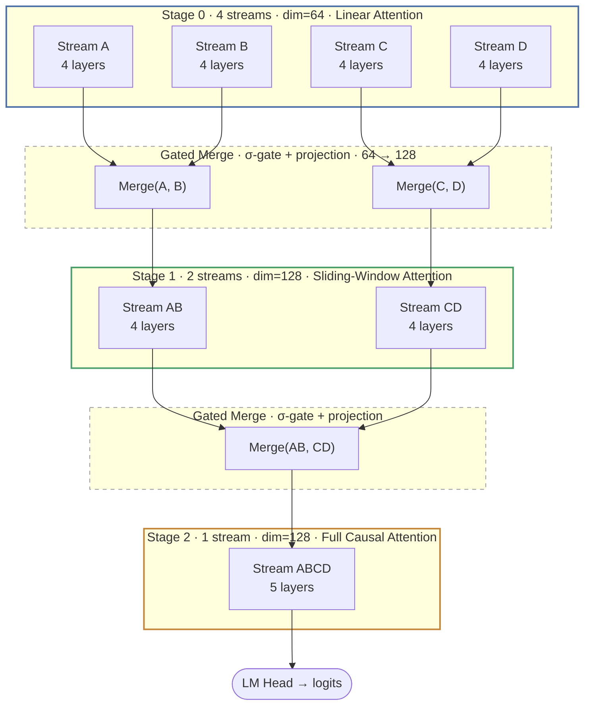

# Felix-LM

**Multi-Stream Progressive Merging for Causal Language Modeling**

[Paper (PDF)](docs/felix_lm_design.pdf) &middot; [Experiment Log](docs/experiments.md) &middot; [Research Directions](docs/research_directions.md)

---

## Abstract

Standard transformer language models process representations through a uniform stack of identical layers. Felix-LM introduces **Multi-Stream Progressive Merging (MSPM)**: the input is processed by multiple independent computational streams that progressively merge into a single output stream through a sequence of structured convergence operations, tracing a helical funnel trajectory in representation space.

The architecture pairs each processing stage with the attention mechanism best suited to its role&mdash;cheap linear attention for broad early exploration, sliding-window attention for local refinement, and full causal attention for the final high-fidelity output&mdash;while gated merge operations between stages learn to selectively combine stream pairs.

## Architecture



**Key components:**

- **Heterogeneous attention** &mdash; Linear (Stage 0) &rarr; Sliding window (Stage 1) &rarr; Full causal (Stage 2), matching compute cost to processing stage
- **Gated merge** &mdash; Learned sigmoid gates with linear projections combine stream pairs between stages; gates train from ~1.0 (fully open) toward ~0.65 (selective)
- **Depth-extended RoPE** &mdash; Positional encoding augmented with network-depth information, encoding both *where* a token is and *how deep* it has been processed
- **Deep supervision** &mdash; Auxiliary language modeling loss at every merge boundary, encouraging useful intermediate representations
- **Cross-stream agreement** &mdash; Pairwise agreement between streams provides a natural confidence signal for potential early exit

## Results

All experiments use ~11M parameters, WikiText-103, sequence length 512, and effective batch size 32.

| Model | Config | Attention | Deep Supervision | Test PPL | Stage 2 PPL |
| :----- | :----- | :-------- | :--------------- | :------: | :---------: |
| M0 (baseline) | `m0` | Full causal | N/A | 115.66 | &mdash; |
| M2 MSPM-Hetero | `m2` | Linear &rarr; Sliding &rarr; Causal | ON | 150.14 | 121.81 |
| M2 Full-Causal | `m2_fullcausal` | Full causal (all stages) | ON | 129.09 | **107.49** |
| M2 No-Supervision | `m2_nosup` | Linear &rarr; Sliding &rarr; Causal | OFF | 118.41 | &mdash; |

**The multi-stream merging mechanism works.** When attention type is controlled for (M2 Full-Causal), the final-stage output at 107.49 PPL beats the parameter-matched single-stream baseline at 115.66&mdash;a 7% improvement from the multi-stream inductive bias alone. Removing deep supervision alone closes M2 to within 2.4% of the baseline, even with cheap linear attention in Stage 0.

### Key findings

- **Stream specialization is real.** Pairwise cosine similarity between stream Q-projection weights converges to ~0.00, indicating fully orthogonal learned representations across all stream pairs.
- **Gates learn meaningful selectivity.** Gate biases drift from initialization at 1.0 to ~0.65 after training (~35% selectivity), with no stream dominance&mdash;both halves gated equally.
- **Merge projections use near-full rank** (97/128 and 106/128), confirming that the gated merge is a genuine information-combining operation, not a bottleneck.
- **Deep supervision hurts at small scale.** Removing it is the single largest improvement (+32 PPL over M2), closing to within 2.75 PPL of the baseline&mdash;even with linear attention in Stage 0. Forcing early stages to predict tokens likely conflicts with learning good intermediate representations for merging.
- **Linear attention is a secondary bottleneck.** Replacing heterogeneous attention with full causal everywhere closed ~60% of the gap to baseline, isolating the attention type as a contributor to M2's underperformance.

## Getting Started

### Installation

```bash
git clone https://github.com/CalebisGross/felix-lm.git
cd felix-lm
python3.12 -m venv .venv
source .venv/bin/activate
pip install torch  # or: pip install torch --index-url https://download.pytorch.org/whl/rocm6.3
pip install -e ".[dev]"
```

### Tests

```bash
pytest tests/ -q
```

### Training

```bash
# Primary architecture (MSPM with heterogeneous attention)
python scripts/train.py --config m2 --batch-size 8 --grad-accum 4 --device cuda

# Baseline transformer
python scripts/train.py --config m0 --batch-size 8 --grad-accum 4 --device cuda

# Ablations
python scripts/train.py --config m2_fullcausal --batch-size 8 --grad-accum 4 --device cuda
python scripts/train.py --config m2_nosup --batch-size 8 --grad-accum 4 --device cuda
```

### Evaluation

```bash
python scripts/evaluate.py --checkpoint checkpoints/m2_fullcausal/best.pt --split test --device cuda --batch-size 8
```

Training logs are tracked with [Weights & Biases](https://wandb.ai) under the `felix-lm` project.

## Project Structure

```text
felix_lm/
├── model.py              # FelixLM top-level module (Algorithm 1)
├── config.py             # FelixConfig dataclass and experiment configs
├── attention.py          # LinearAttention, SlidingWindowAttention, FullCausalAttention
├── merge.py              # GatedMerge, CrossStreamAttention, MergeLayer
├── rope.py               # Depth-extended RoPE (position + layer depth encoding)
├── stage.py              # Processing stage (N streams × L transformer layers)
├── transformer_block.py  # Pre-norm transformer block with SwiGLU FFN
├── embedding.py          # Token embedding + per-stream learned projections
├── exit_heads.py         # Deep supervision loss and cross-stream agreement
├── diagnostics.py        # Gate statistics, stream similarity, agreement logging
└── utils.py              # Training utilities

scripts/
├── train.py              # Training loop with wandb logging and cosine LR
├── evaluate.py           # Evaluation on test/validation splits
└── count_params.py       # Parameter count verification

docs/
├── felix_lm_design.pdf   # Full design document and theoretical foundation
├── experiments.md         # Detailed experiment log with all results
└── research_directions.md # Planned experiments and future work
```

## Citation

If you find this work useful, please cite:

```bibtex
@misc{gross2025felixlm,
  title   = {Felix-LM: Multi-Stream Progressive Merging for Causal Language Modeling},
  author  = {Gross, Caleb},
  year    = {2025},
  url     = {https://github.com/CalebisGross/felix-lm}
}
```

## License

MIT
